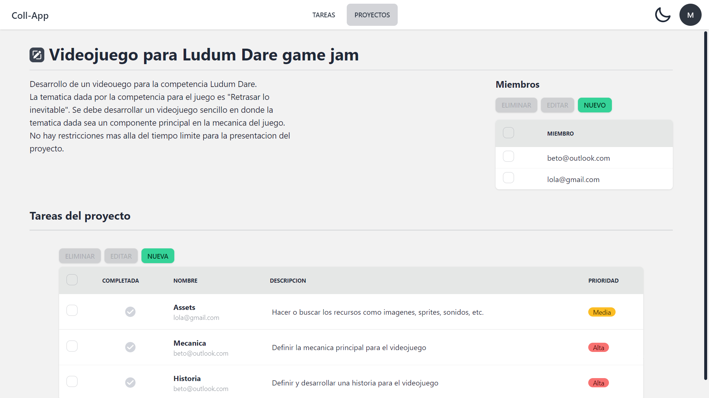

# Coll-App

Aplicación web para la gestión de tareas, con las operaciones clásicas de "Marcar como completada", "Editar" y "Eliminar". Además también ofrece la creación de "Proyectos", los cuales consisten en un conjunto de tareas que pueden ser asignadas a usuarios pertenecientes al mismo Proyecto.

La aplicación fue desarrollada utilizando Angular; la librería Angular Fire para la comunicación con los servicios de Firebase; DaisyUI para los estilos; el servicio de Autenticación de Firebase para la gestión de usuarios, y el servicio Firestore Database de Firebase para los datos.

## Tecnologías usadas
### Frameworks y librerías

- [Angular](https://angular.io/)
- [Angular Fire](https://github.com/angular/angularfire)
- [Firebase SDK](https://github.com/firebase/firebase-js-sdk)
- [Tailwind CSS](https://tailwindcss.com/)
- [DaisyUI](https://daisyui.com/)

### Servicios

- [Firebase](https://firebase.google.com/)

